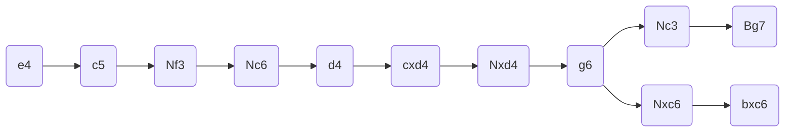
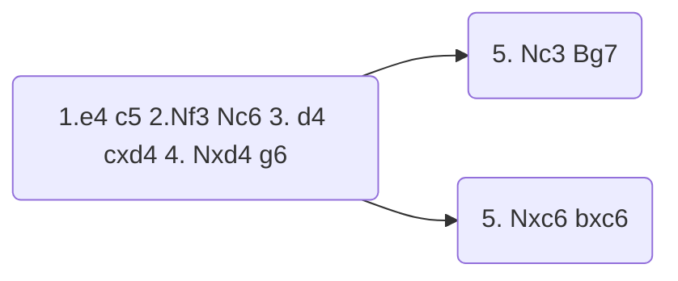
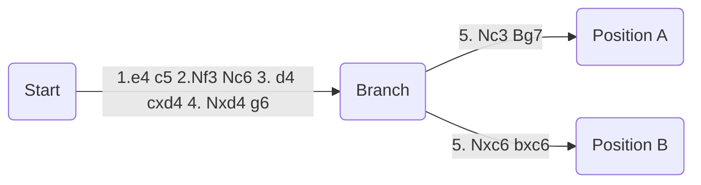
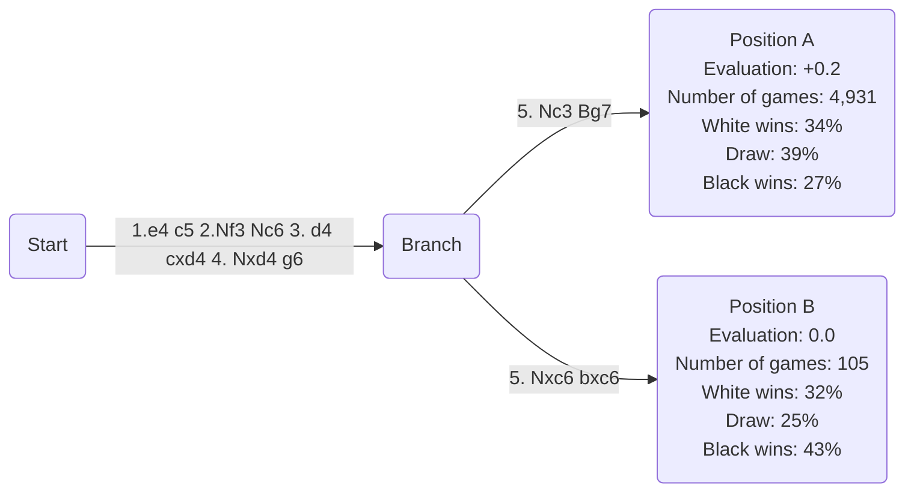

Two of the most import concepts in computer science for a few reasons:

1. They're everywhere
2. They'll get you a job
3. They can be fascinating

### 1. They're everywhere

Any program that's performing any real function is going to need to store and organize some data. If you've ever used an array, a list, a stack, a queue, or a tree, you've used data structures. If you've done anything with those structures, you've used algorithms. Even if you're using the built-in ones (e.g. `array.sort()`), you can avoid bugs and performance issues by understanding what's happening "under the hood".

### 2. They'll get you a job

Like it or not, coding interviews tend to lean problems focused on solving abstract data structure and algorithms problems. Just see the popularity of such resources as [leetcode](leetcode.com) or ['Cracking the Coding Interview'](https://www.crackingthecodinginterview.com).

### 3. They can be fascinating

Like code and chess, algorithms are all about logic. When you come to understand it deeply, it has a feeling of *truth* to it. There is no arguing with an algorithm, a proof, or a checkmate.

Algorithms (especially sorting and searching) lend themselves to interesting visualization too, a topic I've always found interesting. The differences between algorithms appear in the unique character of each visualization.

# Chess

Where does chess come in? With the great "Covid-and-Queen's-Gambit Chess Boom of 2020" of course! Like many others I became interested in the beautifully simple but dizzyingly complex game. For me, chess puzzles pulled me in, appealing to my brain in the same way that coding and logic puzzles have for years. Instead of Instagram or Twitter, Chess.com became the go-to app on my phone when I had some time to kill.

## Possible games, possible worlds

The idea of "opening theory" in chess is intimidating. From the first move of the game, there are dozens of possible moves in each position, leading to nearly infinite possibilities. In fact, a *conservative estimate* of the number of possible chess games is `10^120`. If the search is limited to "sensible moves" (excluding moves that are immediately game-losing), we still have `10^40` possible games to consider.

These calculations were shown in order to demonstrate the impossibility of solving chess by brute force. Fortunately, over the years, great chess minds have further limited the scope by identifying common sequences of best moves, a field of study called opening theory.

## Theory

Over the years, chess enthusiasts have identified and named some of the best ways to begin a game of chess. There are of course still many, many possible routes a game can take. There exist thousands of opening books, ranging in scope from broadly covering a first move (e.g. King's Pawn openings, which begin after `1. e4`), to covering possible continuations from a position 10 moves in (e.g. the Sicilian, Accelerated Dragon variation).

### On notation

SAN: "Standard Algebraic Notation"
 : System of recording chess moves by indicating the move number, piece, and its position.

PGN: "Portable game notation"
 : A format for storing one or more chess games, including metadata (players, date, location, etc), comments and analysis.

For example, the aforementioned "Accelerated Dragon" opening would be written as follows:

```
1. e4 c5
2. Nf3 Nc6
3. d4 cxd4
4. Nxd4 g6
5. Nc3 Bg7
```

Where the capital letter indicates which piece has moved (K for King, Q for Queen, R for Rook, B for Bishop, N for Knight, and nothing for a pawn), an `x` indicates a capture, and the coordinate of the square to which the piece has moved.

## Studies

That works well for describing the moves that occurred game, but what if we want to consider alternative routes the game could have gone? What if we want to make a plan, and prepare for all the reasonable moves our opponent could make? That's where we return to analysis and opening theory.

Let's return to the position after move 4 of the Accelerated Dragon:

```
1. e4 c5
2. Nf3 Nc6
3. d4 cxd4
4. Nxd4 g6
```

The "main line" we analyzed here continued with `5. Nc3`, but that's not the only move that White could make in this position. White could also play `5. Nxc6`, taking Black's knight. Black would then not want to play `...Bg7`, but instead take the knight back with `...bxc6`. With that inclusion, our PGN looks like this:

```
1. e4 c5
2. Nf3 Nc6
3. d4 cxd4
4. Nxd4 g6
5. Nc3 (5. Nxc6 bxc6) Bg7
```

# Let's put it all together

What would that look like if we graphed it?



Looks like a tree! That's a lot of nodes, though, for just a small example. We can imagine how this would get out of control for a more complex study.

One observation -- studies are generally made up of sequences of moves that follow logically. They've ignored the vast majority of possible branches, actually, for being either easy to refute (i.e. moves that are clearly bad or do not address the problems of the position), or out of scope (a different opening entirely). What if we graphed the sequences instead of the individual moves?



Only three nodes! That's much better. Now the nodes aren't representing moves though, they're representing "lines", or sequences of moves. We might be able to do some more interesting things with the graph if we can assign attributes to each node, but a line doesn't really have attributes (such as computer evaluation, (number of) games recorded), a *position* does. Let's try one more time:




And what can we say about those positions? We can use some data from [lichess](https://lichess.org).



Now we can use this to guide our study -- for example, from the perspective of the White pieces we can see we should probably play `5. Nc3`, as it scores about the same for White but scores worse for Black.

As the Black pieces we learn we should prioritize studying the continuations after `5. Nc3` over those after `5. Nxc6`, because it is much more likely to occur in a game.

# What's next?

See [projects `chess-tree-graph` and `chess-study-viewer`](../../projects) for some experimentation with these ideas.
